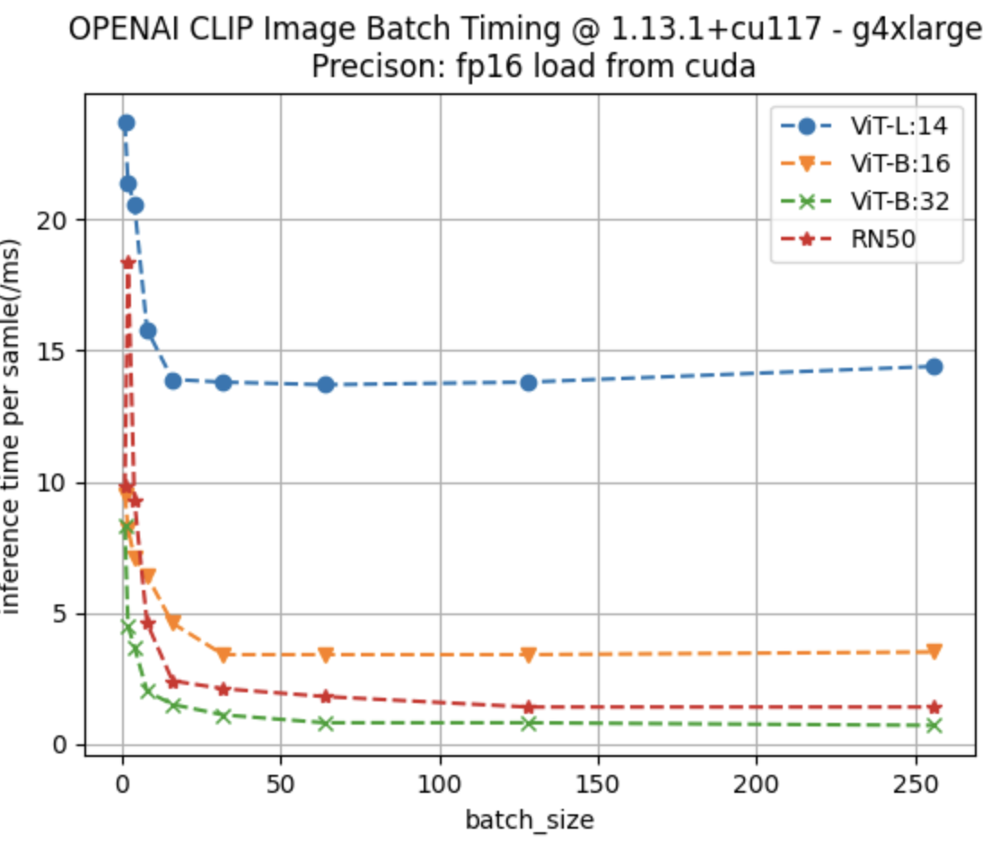

# The Throughput Test

### Set up

This test directly follows the concurrent image downloading. We assume we have a list of `local path` of images awaiting
inference. The full pipeline involves following steps:
- image loading (`PIL.Image.open()`)
- image preprocess (`clip.preprocess`)
- image inference (`clip.model.encode_image`)

Among above 3 steps, only image inference benefits from `batching` strategy. In this test, we choose the `batch_size = 64`
based on the following figure:
<p align = "center">

</p>


To boost the throughput, all the clip models are in `torch.float16` precision.

### Methods

#### Method 1: Locally

This method takes the image path, load all of them, preprocess the image, and then inference all the images in a bach_manner.

code:
```python
# warm up
with torch.no_grad():
    _ = model.encode_image(preprocess(Image.open('/home/ec2-user/SageMaker/bentoml/coco.jpg')).unsqueeze(0).to(torch.float16).to("cuda"))

start = timer()
for i in range(0,1000,64):
    batch_images_path = total_images_path[i:min(i+64,999)]
    
    batch_images = [Image.open(i) for i in batch_images_path]
    processed_image = torch.stack([preprocess(i) for i in batch_images]).to(torch.float16).to("cuda")
    
    with torch.no_grad():
        _ = model.encode_image(processed_image).cpu().numpy()
time = timer() - start
print(f"Throughput: {60/time * 1000}.")
```


#### Method 2: Inference Server - BentoML

This method concurrently sends the `image_path` to the inference server, and the server will 
load the image locally, preprocess the image, and adaptively batch the inference. 


### Results

The metric `througput` is `the number of inferenced images per minute`. Results can be found
in the following table:


| Method/Models | ViT-L/14 | ViT-B/16 | ViT-B/32 |
|---|---|---|---|
| Inference Server | 3530 | 6666 | 8571 |
| Locally | 2761 | 5494 | 6984 |
